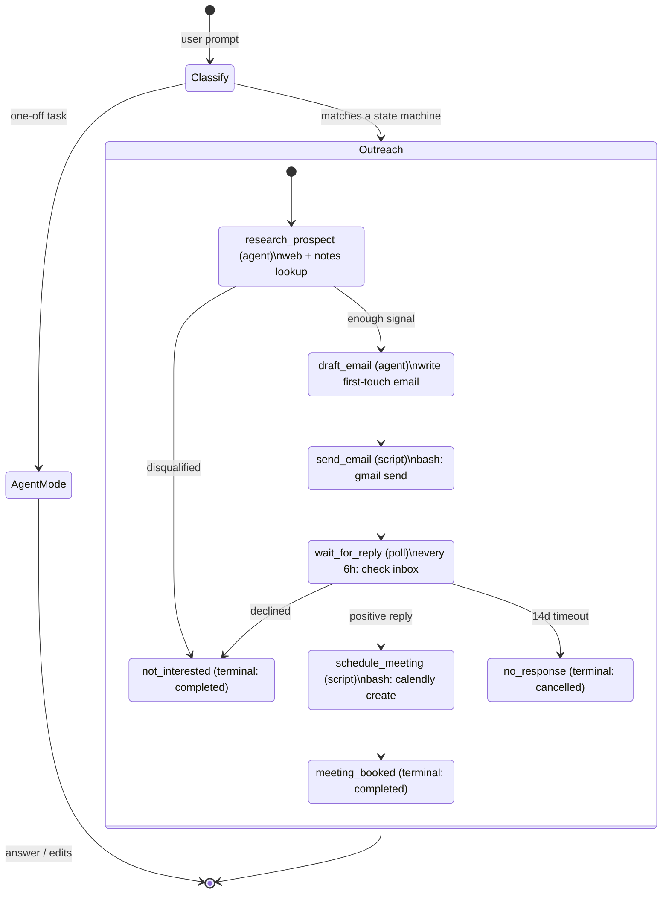

# duet-agent

An opinionated, full-stack agent turn runner. Native multimodal memory. Native interrupts. Multi-agent by default. Serverless-friendly: every turn rehydrates from on-disk state, so a session can pause for minutes or months and resume in a fresh sandbox.

## Why another agent framework?

Existing agent turn runners treat tools and memories as pluggable modules. This makes them flexible but fundamentally disconnected — memory is an afterthought.

duet-agent takes the opposite approach: **memory is woven into the core architecture.** Observations are recorded as the agent works, persisted across processes, and reflected when context grows; the runner cannot run without them. Interrupts are handled by the underlying pi agent runtime, so the turn runner does not need its own interrupt bus.

## Architecture

The diagram below walks through a realistic agent-routed state machine: outbound conference
outreach. The user prompt enters the `TurnRunner`, the runner agent picks the next state based on
prompt, history, and available state definitions, and the state machine drives the business process
until it hits a terminal state. The same definition can start in the middle — for example, the
runner can skip straight to `wait_for_reply` if the user says “I already emailed them”.



Each state is one of the four kinds the runner understands:

- **agent** states run a sub-agent with a prompt, optional system prompt, and optional skill allowlist.
- **script** states shell out (`bash`, `curl`, CLIs) for anything with an API.
- **poll** states wait on an external signal by running one script check per interval, or by using a timer poll for pure delays.
- **terminal** states record a business outcome (`completed`, `cancelled`, `failed`).

Observational memory, pi coding tools, and guardrails sit underneath every state transition; they
are not states themselves.

## Key Differentiators

### Native Multimodal Memory

Memory is first-class. The default `MemoryStore` is in-memory and emits observation events; optional PGlite storage hydrates and persists durable observations outside the turn runner session.

The memory model follows observational memory: turn runner session messages are observed into durable text observations, and a reflector condenses observations when they grow too large. Observations are scoped as `session` or `resource`.

Observation is multimodal. When messages contain images, the observer inspects them directly and records visual details, user-visible text, UI state, diagrams, and errors as text observations. The agent keeps continuity over screenshots, scanned documents, and other image attachments without re-attaching the original bytes on every turn.

### Pi Coding Tools

Sub-agents use the default tools from `@earendil-works/pi-coding-agent`: read, bash, edit, and write. The turn runner supplies a working directory and can restrict which skills are injected into a state-machine agent state; it does not wrap those tools in a second sandbox abstraction.

### Native Interrupts

Interrupt behavior comes from the underlying pi agent runtime. A user can send a message while a pi session is running, and the runtime can handle it as an interruption or as a follow-up. duet-agent does not add a second interrupt bus on top.

### Multi-Agent by Default

The turn runner can delegate durable process steps into agent states. Agent states are not pre-built classes; they are state-machine states with prompts, optional system prompts, and optional skill allowlists.

### Serverless- And Sandbox-Friendly

`TurnRunner` is stateless across process boundaries. `TurnState` is the only runner state that needs to survive, and durable observations live in PGlite. A new process — including a fresh serverless invocation, a new sandbox container, or a different machine — can resume by passing the saved state to `runner.start({ state: savedState })`.

This makes long-running work practical without keeping a process alive. A state machine can sit in `wait_for_reply` for weeks, woken by a cron-driven `wake` command between runs. Work that spans months — outbound outreach loops, slow build-and-review cycles, scheduled retries — follows the same shape as a one-shot turn: load state, start the runner, run a turn, persist the terminal state, exit.

### Three Execution Modes

The turn runner has three top-level modes:

- `agent`: handle the prompt as a normal agent session. This is for one-off tasks, coding requests, reviews, research, and anything that can complete in the current session.
- `state_machine`: route the prompt into an agent-routed state machine. This is for long-running business processes with durable state, waits, and terminal business outcomes.
- `auto`: let the turn runner classify the prompt and choose either `agent` or `state_machine`.

Normal agent mode handles immediate work; state-machine mode handles business processes that may pause, resume, wait on external systems, or start in the middle based on the user's prompt. In `auto`, the runner classifies the prompt and routes to whichever fits.

### Agent-Routed State Machines

duet-agent is exploring long-running agent-routed state machines for business processes like outbound sales, conference outreach, and development loops. The design goal is **not** to become a workflow engine like Temporal, Airflow, or GitHub Actions.

Instead, state machines are agent-routed. A state-machine definition describes the available business states: agent states, shell-script states, poll states, and terminal states. The runner keeps the state-machine system prompt cache-friendly by including only stable routing instructions plus the original prompt and available state definitions. Current state and history stay in the parent agent conversation, where state transitions, script results, poll results, and user follow-ups are already recorded.

The state machine is higher level than task execution. It tracks one current business state at a time. If a state needs fan-out, parallelism, or a task-level workflow, that belongs inside an agent or script state. The agent can execute a complex workflow internally; the state machine only records the business transition before and after that state.

This keeps state machines flexible enough to start in the middle. For example, a user can say: "prospect person X, I've already sent email, just wait for response." The same outreach state machine can skip research and email sending, then choose the wait-for-response state because the runner agent understands the existing context.

External integrations stay simple: anything with an API or CLI is a script state or script poll. Timer polls cover pure delays such as "wait before retry." Email, GitHub, Calendly, CRM systems, and webhooks do not need first-class engine concepts. If the state machine can tolerate a few minutes of polling delay, a bash script is enough.

What this is not:

- Not a deterministic DAG scheduler.
- Not a low-level durable execution runtime.
- Not a workflow service with queues, workers, locks, and retries as the main abstraction.
- Not a replacement for infrastructure workflow engines when exact-once execution or strict SLAs matter.

The turn runner should provide enough structure for an agent to make good process decisions, while leaving hard operational guarantees to external systems.

### Optional Guardrails

Pattern-based (fast, regex) and semantic (LLM-evaluated) guardrails compose into a firewall. Every bash command and file write can be checked before execution.

### Remote MCP Tools

`TurnRunner` can attach to remote [Model Context Protocol](https://modelcontextprotocol.io) servers over the streamable-HTTP transport. Pass `mcpServers` on `start` and the runner connects, lists each server's tools, and exposes them to the parent and state agents alongside the built-in coding tools. Tool names are namespaced as `{server}__{tool}` so multiple servers can coexist without collisions.

```ts
await turnRunner.start({
  mcpServers: {
    docs: {
      type: "http",
      url: "https://mcp.example.com/docs",
      headers: { "x-api-key": process.env.DOCS_KEY! },
    },
  },
});
```

Only HTTP MCP is supported today; authentication is intentionally out of scope, so any credentials a server expects must travel in `headers`. Connection failures are logged and skipped so a single broken server cannot block session setup.

## CLI Install

The CLI runs on Bun because OpenTUI is Bun-native. Install Bun first if it is not already available:

```bash
curl -fsSL https://bun.sh/install | bash
```

Install the CLI globally to make the `duet` command available on your PATH:

```bash
bun add --global @duetso/agent
```

You can also install it globally with another package manager:

```bash
npm install --global @duetso/agent
pnpm add --global @duetso/agent
yarn global add @duetso/agent
```

Upgrade an existing global installation:

```bash
duet upgrade
```

## SDK Install

Install the package as a dependency when you want to use the turn runner from TypeScript or JavaScript:

```bash
npm install @duetso/agent
```

## Development

This repo uses Bun for package management, Husky for pre-commit checks, and Docker for functional tests.

```bash
bun install
bun run setup  # install/start Docker on macOS or Linux if needed
bun run check-types
bun run lint
bun run eval   # runs live evals inside Docker
bun run test   # runs the test suite inside Docker
```

Use `bun run test` and `bun run eval`, not raw `bun test`, as the source of truth. File-writing tests and evals run in Docker so focused host runs cannot create `.duet`, PGlite databases, or home-directory skill fixtures in the checkout.

The pre-commit hook runs `format`, `check-types`, and `lint`.

## CLI Quick Start

The quickest way to get started is `duet login`, which signs in via your browser, writes `DUET_API_KEY` to `~/.duet/.env`, and syncs the default skills:

```bash
duet login
duet "build a REST API with Express"
```

If you would rather manage provider API keys yourself, use `duet env` (see [CLI Env Setup](#cli-env-setup) below) or set a provider API key in the environment, `<workdir>/.env`, or `~/.duet/.env`. When `--model` is omitted, the CLI infers a default from the configured provider: Anthropic, AI Gateway, and OpenRouter use Opus 4.7; OpenAI uses GPT-5.5.

```bash
export ANTHROPIC_API_KEY=sk-...

# Start a session
duet "build a REST API with Express"

# Open an interactive session without an initial prompt
duet

# With options
duet -m opus-4.7 --workdir ./my-project "refactor the auth module"

# With a custom observational memory model
duet --memory-model sonnet-4.6 "summarize this repo"

# With additional system instructions
duet --system-prompt "Prefer concise answers." "review this repo"

# Override the default AGENTS.md system prompt file
duet --system-prompt-file TEAM.md "review this repo"

# Disable system prompt file loading
duet --no-system-prompt-files "review this repo"

# Resume a saved session
duet --resume session_abc123 --workdir ./my-project

# List installed skills (project + user scope)
duet skills

# Through Vercel AI Gateway
export AI_GATEWAY_API_KEY=...
duet -m opus-4.7 "review this repo"
```

Model names can use full `provider:modelId` syntax or shorthand names such as
`opus-4.7`, `sonnet-4.6`, `haiku-4.5`, and `gpt-5.5`. Shorthands resolve to the
first configured supported provider; use full `provider:modelId` syntax to pin a
specific provider.

### CLI Login

`duet login` is the recommended setup path. It opens a browser to sign in, writes `DUET_API_KEY` for the selected org to `~/.duet/.env`, and syncs the latest default skills into `~/.duet/skills`.

Once you have synced default skills at least once, every subsequent `duet` invocation refreshes them in the background using a conditional GET against the saved hash. Logging in with `--skip-skill-sync` leaves no hash on disk, so this auto-refresh stays a no-op until you explicitly opt in by syncing once.

```bash
duet login

# Print the auth URL instead of opening a browser
duet login --no-browser

# Skip the post-login default skill sync
duet login --skip-skill-sync
```

### CLI Env Setup

`duet env` is the manual alternative for users who want direct control over which provider API keys land in the shared env file. Without an action it just prints help. Add an explicit action to create or update the shared env file at `~/.duet/.env`:

```bash
# Import .env from the current directory into ~/.duet/.env
duet env --import

# Import a specific env file
duet env --import ./path/to/.env

# Paste supported provider API keys interactively
duet env --keys

# Use a custom shared env file instead of ~/.duet/.env
duet env --env-file ~/.config/duet/env --keys
duet --env-file ~/.config/duet/env "review this repo"
```

The CLI loads `<workdir>/.env` first, then the shared env file, so project-specific values override shared defaults. Supported keys are `DUET_API_KEY`, `ANTHROPIC_API_KEY`, `AI_GATEWAY_API_KEY`, `OPENROUTER_API_KEY`, and `OPENAI_API_KEY`.

For local development from a checkout, use the package script:

```bash
bun run cli -- "build a REST API with Express"
```

## SDK Quick Start

```typescript
import { TurnRunner } from "@duetso/agent";

const turnRunner = new TurnRunner({
  model: "opus-4.7",
  cwd: process.cwd(),
  mode: "auto",
});

// `start` is setup-only: loads skills and memory, emits `turn_started`, runs no agent work.
await turnRunner.start({ mode: "auto" });

const terminal = await turnRunner.turn({
  type: "prompt",
  message: "Build a todo app with React and TypeScript",
  behavior: "follow_up",
});
```

`TurnRunner.turn()` is the concurrency boundary. Callers may call it repeatedly
while work is active; the runner folds active `prompt` and `answer` commands
back into the active pi agent as `steer` or `follow_up`, queues wakes and other
work it cannot absorb immediately, and emits one terminal event when the whole
active work chain is done. The parent runner transcript stays linear: state
machine continuations, script results, poll results, and user follow-ups rejoin
the parent agent rather than creating separate conversation branches.

## Memory And Persistence

`TurnRunner` owns memory at runtime. It holds a `MemoryStore` in process, hydrates durable observations from PGlite before the first turn, and subscribes to memory-store events to write future observation changes. Raw conversation messages stay in `TurnState.agent.messages`; memory persistence stores only derived observations/reflections.

```typescript
import { TurnRunner } from "@duetso/agent";

const turnRunner = new TurnRunner({
  model: "opus-4.7",
  memoryDbPath: false, // Keep observational memory in process only.
});
```

By default, the CLI stores durable observations in `~/.duet/memory.db`; run it with `--no-memory` to keep observational memory in process only. Programmatic callers can pass `memoryDbPath: false` or provide a custom `memoryDbPath`. The CLI's `SessionManager` is a convenience layer that stores session snapshots under `~/.duet/sessions`, but the runner owns memory hydration, compaction, and observation persistence.

You can also resume directly from saved state. The runner owns state
internally after `start`, so resumed state is handed in through the start
command and later turns just send prompts:

```typescript
await turnRunner.start({ state: savedState });

const terminal = await turnRunner.turn({
  type: "prompt",
  message: "Continue the previous goal",
  behavior: "follow_up",
});
```

Resume continues turn runner session state, not an in-flight model/tool call. Any `in_progress` todo is retried from `pending`.

Observational memory is enabled by default with thresholds tuned for modern 200k-token model windows:

- Raw messages are observed around `150_000` tokens so exact transcript context and prompt caching are used before compaction.
- Observation logs are reflected around `90_000` tokens, targeting about `65_000` tokens after reflection.
- Raw-tail retention keeps about `40_000` exact message tokens after observation activation.
- Observation context is injected as reminder messages; replacing raw context with observations/reflections is the compaction path.

## Skills

Skills are loaded from `<cwd>/.duet/skills`, `<cwd>/.agents/skills`, `~/.duet/skills`, and `~/.agents/skills` by default, using `@earendil-works/pi-coding-agent`'s skill loader. The turn runner injects every loaded skill's description and instructions into the agent system prompt.

After `start`, the runner exposes what it discovered:

- `getSkills()` returns the loaded skills, including YAML frontmatter descriptions such as block scalars.
- `getResolvedAgentFiles()` returns the system-prompt files (e.g. `AGENTS.md`) found on disk for the session.
- `getSkillCollisions()` returns name collisions across skill scopes so a CLI or UI can warn about ambiguous skills.

## Guardrails

The turn runner installs its default safety checks internally. Add extra guardrail config objects when a deployment needs stricter local policy.

```typescript
const turnRunner = new TurnRunner({
  // ...
  guardrails: [
    {
      kind: "pattern",
      rules: [
        { pattern: /production-db/i, action: "warn", reason: "Production database mentioned" },
      ],
    },
    {
      kind: "semantic",
      model: getModel("anthropic", "claude-haiku-4-5"),
      policy: "Never delete production data. Never expose secrets in output.",
    },
  ],
});
```

## Design Principles

1. **Files and CLI at the core.** Local tools stay simple: if you can do it with bash, scripts, or files, you can make it part of a turn. Remote MCP tools are supported as an integration boundary, not as the core execution model.
2. **State in memory, durability on disk.** `TurnRunner` owns `TurnState` and memory in process, while persistence keeps snapshots and observations on disk. Any process can resume by handing the saved state back to `runner.start`.
3. **Agent-routed state machines over workflow engines.** Long-running state machines describe available business states; a runner agent decides what to do next from prompt, state, and history. Task-level workflows belong inside agent or script states.
4. **Dynamic over static.** Agent states are defined by state machines at runtime, not pre-built classes.
5. **Simple over flexible.** Default pi coding tools. One default memory store. Constraints breed creativity.

## License

Apache-2.0
