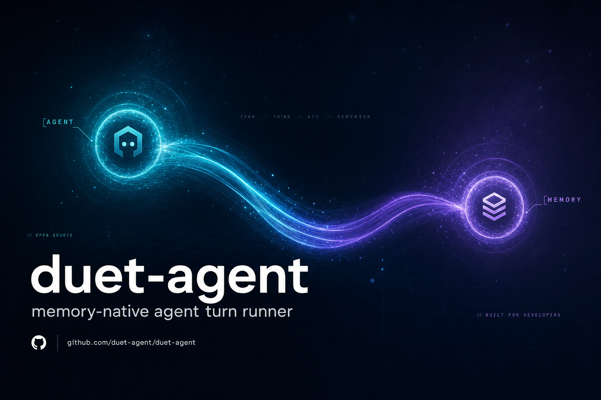
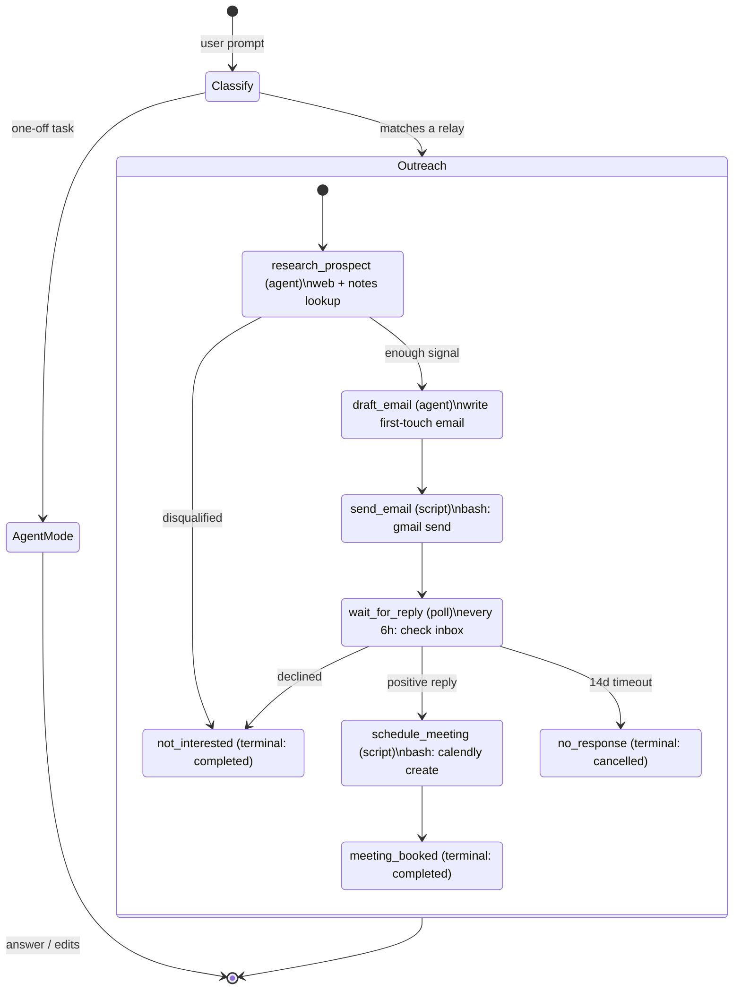
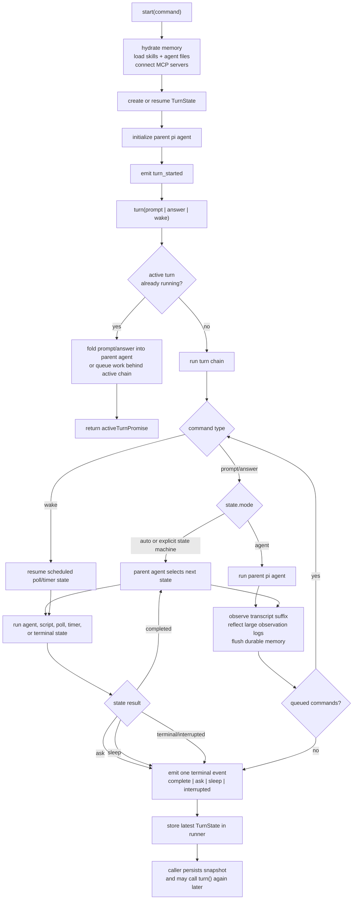

# duet-agent

[](https://duet.so)
[](https://www.npmjs.com/package/@duetso/agent)
[](LICENSE)
[](https://github.com/dzhng/duet-agent/actions/workflows/ci.yml)
[](https://bun.sh)

**The agent harness for jobs that outlive the chat.**

How do you keep an agent working until the job is done? Most harnesses don't have an answer — the chat ends, the process dies, the context goes with it. duet-agent has three. A session can pause for minutes or months and pick up in a fresh sandbox without losing the thread.

```bash
npm install -g @duetso/agent
duet login
duet "prospect the VP Eng at Acme, send a first-touch email, and book a meeting if they reply"
```

One `duet login` writes `DUET_API_KEY` to `~/.duet/.env` and unlocks frontier language models (Claude, GPT, Gemini), image and video models, and Firecrawl-powered web skills through the Duet AI Gateway. No separate provider billing. ([CLI Env Setup](#cli-env-setup) if you'd rather bring your own keys.)

## Jobs that don't fit in one chat

- **Long-running outreach and lifecycle work.** Prospect → email → wait 14 days → book → handoff. The relay sits in `wait_for_reply` for a week without a process alive.
- **Coding sessions that don't forget.** Resume a refactor a month later and the agent still knows what it tried, what worked, and what you told it never to do again.
- **Multi-step research with receipts.** Each step is an observable state — agent, script, poll — not a black-box chain. You can start in the middle: "I already did the research, just draft the email."
- **Serverless and sandboxed turns.** `TurnState` is the only thing that needs to survive between turns. Cron wakes it up, runs one turn, persists, exits.
- **Slow, scheduled, recurring work.** Cold outbound, weekly digests, review cycles, scheduled retries, long-running migrations — anything where the next step is hours or days away.

If the work fits in one chat, you probably don't need this. If it doesn't, most harnesses make you bring your own memory layer, your own queue, your own resume logic. That's the gap.

## Why another harness?

Most agent frameworks are good at _one turn_. They're not built for _the job_. Memory is a plugin, durable processes are "wire up Temporal," and resume-from-disk is something you bolt on at the end and regret. The interesting work — _remembering across turns, picking up where you left off, knowing when to ask vs. when to keep going_ — is left to you.

Both Claude Code and Codex are excellent at the _one-turn_ job: edit this file, run this command, answer this question. duet-agent is built for the layer _above_ that — work that has to remember, wait, resume in a different process, and route itself.

|                                        | Claude Code                                                                                                                     | Codex CLI                                                                  | **duet-agent**                                                                                                                                                          |
| -------------------------------------- | ------------------------------------------------------------------------------------------------------------------------------- | -------------------------------------------------------------------------- | ----------------------------------------------------------------------------------------------------------------------------------------------------------------------- |
| **Cross-session memory**               | `CLAUDE.md` (you write it) + auto-memory (Claude writes it, per-repo, capped at the first 200 lines / 25 KB loaded per session) | `AGENTS.md` (you write it; hierarchical `AGENTS.override.md` in subdirs)   | **Observational memory in PGlite with hybrid retrieval (pgvector + tsvector, fused via RRF). The agent observes its own transcripts and recalls them across sessions.** |
| **Memory of images**                   | Images stay in the active transcript only                                                                                       | Images stay in the active transcript only                                  | **Vision-capable models observe screenshots and UI captures into text observations the agent can recall on later turns**                                                |
| **Resume across a fresh process**      | `claude --resume <id>` / `--bg` background sessions — replays a saved transcript                                                | `codex resume <id>` — replays a saved transcript from `~/.codex/sessions/` | **`TurnState` snapshot on disk; any fresh process — new sandbox, serverless invocation, different machine — resumes with `runner.start({ state })`**                    |
| **Long-running, multi-step workflows** | Background sessions; no native poll/wait/state-machine primitives                                                               | Transcript-driven; no native poll/wait/state-machine primitives            | **Relays: agent-routed state machines with five state kinds — `agent`, `script`, `poll`, `timer`, `terminal`. Wait days for a reply between turns.**                    |
| **Models you can use**                 | Anthropic                                                                                                                       | OpenAI (Sign in with ChatGPT or API key)                                   | **Anthropic, OpenAI, OpenRouter, Vercel AI Gateway, Duet Gateway**                                                                                                      |
| **License**                            | Proprietary (closed-source CLI)                                                                                                 | Apache-2.0                                                                 | **Apache-2.0**                                                                                                                                                          |

None of this makes Claude Code or Codex worse at what they do. It makes duet-agent the right thing to reach for when the job is too long for one chat — when memory has to survive the session, when a process has to wait on an external signal, when a turn has to resume in a container that didn't exist when the work started.

Two things that don't get a section of their own below, but that follow from the same shape:

- **One login, every frontier model.** `duet login` is the whole setup. Claude, GPT, Gemini, image, video, web — all behind one key.
- **Open source.** No black box. If we made a wrong call about how memory ranks or how relays route, you can read the code and tell us we're wrong.

## What we do differently

### Memory, woven in

Memory and compaction are the same primitive: observational memory _is_ how context survives between turns. The runner observes its own transcript, reflects when observations grow, and writes durable rows to PGlite — text observations for messages and images alike, so screenshots and UI captures stay recallable on later turns without re-attaching bytes. Each turn's prompt prefix is frozen between deliberate refresh points: curated memory files load from the project ancestry at session start or explicit skills reload, while long-term and current-session observations rebuild at compaction events. That separation keeps trained knowledge deterministic, prevents it from displacing observational memory, and preserves the provider's prompt cache turn-over-turn. Database observations outside the frozen prefix stay reachable through `recall_memory` — hybrid retrieval over pgvector cosine similarity and tsvector keyword search, fused via Reciprocal Rank Fusion, with optional paraphrased query expansion. Embeddings run in a background worker so foreground turns never block.

### Relays: keep the agent working until the job is done

A relay is how duet-agent stays on task across hours, days, or months. Under the hood it's a state machine — but the runner agent, not a config file, picks the next transition every turn. Enough structure to route long work; not so much that the agent is locked into a path. Each state is one of five kinds:

- **agent** — a sub-agent with a prompt, optional system prompt, and optional skill allowlist.
- **script** — shell out to `bash`, `curl`, a CLI. Anything with an API is a script state.
- **poll** — recurring check on an external signal (inbox, build status, webhook).
- **timer** — a pure delay until a wall-clock time, no script attached.
- **terminal** — record a business outcome: `completed`, `cancelled`, `failed`.


That's the whole vocabulary. Email, GitHub, Calendly, CRM — none of them need first-class engine concepts; they're shell scripts. Relays can start in the middle ("I already emailed them, just wait for a reply") because the runner agent reads context, not a workflow ID.

> [!NOTE]
> This is **not** Temporal. Not a deterministic DAG, not an exact-once runtime, not a workflow service. It's enough structure for an agent to make good process decisions, and hand operational guarantees off to external systems when they matter.

### State on disk, serverless by default

A turn is a pure function of `TurnState`. The runner owns it in process while a turn runs; persistence keeps it on disk between turns. Any process — the same shell tomorrow, a fresh sandbox, a serverless invocation, a different machine — can pick up where the last one left off by calling `runner.start({ state })`. There are no sticky workers, no warm pools, no session affinity to lose. Cron wakes the container, hands it the snapshot, runs one turn, persists, exits. That's the whole deployment model when you want one.

### Three modes: agent, relay, auto

The same runner handles both shapes of work. `agent` mode treats the prompt as a normal session — coding, research, review, one-off tasks. `state_machine` mode (surfaced as **relays** in the UI) routes the prompt into an agent-routed business process with durable waits and terminal outcomes. `auto` lets the runner classify the prompt and pick. One CLI, one SDK; the long jobs and the short ones use the same code path.

## Architecture

A realistic agent-routed relay: outbound conference outreach. The user prompt enters the `TurnRunner`, the runner agent picks the next state from prompt + history + available states, and the relay drives the business process until it hits a terminal state. The same definition can start in the middle — for example, the runner can skip straight to `wait_for_reply` if the user says "I already emailed them."

<details>
<summary><b>Full architecture diagram</b> (click to expand)</summary>



</details>

Observational memory, pi coding tools, and guardrails sit underneath every state transition; they are not states themselves.


_One prompt, a job that can run for weeks, months, or even years. The power of state machines a.k.a. relays in duet._

## Other capabilities

<details>
<summary><b>Optional guardrails</b></summary>

Pattern-based (fast, regex) and semantic (LLM-evaluated) guardrails compose into a firewall. Every bash command and file write can be checked before execution.

```typescript
const turnRunner = new TurnRunner({
  guardrails: [
    {
      kind: "pattern",
      rules: [
        { pattern: /production-db/i, action: "warn", reason: "Production database mentioned" },
      ],
    },
    {
      kind: "semantic",
      model: getModel("anthropic", "claude-haiku-4-5"),
      policy: "Never delete production data. Never expose secrets in output.",
    },
  ],
});
```

</details>

<details>
<summary><b>Remote MCP tools</b></summary>

`TurnRunner` can attach to remote [Model Context Protocol](https://modelcontextprotocol.io) servers over the streamable-HTTP transport. Pass `mcpServers` on `start` and the runner connects, lists each server's tools, and exposes them to the parent and state agents alongside the built-in coding tools. Tool names are namespaced as `{server}__{tool}` so multiple servers can coexist without collisions.

```ts
await turnRunner.start({
  mcpServers: {
    docs: {
      type: "http",
      url: "https://mcp.example.com/docs",
      headers: { "x-api-key": process.env.DOCS_KEY! },
    },
  },
});
```

Only HTTP MCP is supported today; authentication is intentionally out of scope, so any credentials a server expects must travel in `headers`. Connection failures are logged and skipped so a single broken server cannot block session setup.

</details>

<details>
<summary><b>Native interrupts</b></summary>

Interrupt behavior comes from the underlying pi agent runtime. A user can send a message while a pi session is running, and the runtime can handle it as an interruption or as a follow-up. duet-agent does not add a second interrupt bus on top.

</details>

<details>
<summary><b>Pi coding tools</b></summary>

Sub-agents use the default tools from `@earendil-works/pi-coding-agent`: read, bash, edit, and write. The turn runner supplies a working directory and can restrict which skills are injected into a state-machine agent state; it does not wrap those tools in a second sandbox abstraction.

</details>

## Install

```bash
# CLI — npm
npm install -g @duetso/agent

# CLI — Bun (the CLI is Bun-native)
curl -fsSL https://bun.sh/install | bash
bun add --global @duetso/agent

# SDK
npm install @duetso/agent
```

<details>
<summary><b>Other package managers and upgrade paths</b></summary>

```bash
npm install --global @duetso/agent
pnpm add --global @duetso/agent
yarn global add @duetso/agent

# Upgrade an existing global install
duet upgrade
```

The CLI runs on Bun because OpenTUI is Bun-native.

</details>

<details>
<summary><b>Development setup</b></summary>

This repo uses Bun for package management, Husky for pre-commit checks, and Docker for functional tests.

```bash
bun install
bun run setup        # install/start Docker on macOS or Linux if needed
bun run check-types
bun run lint
bun run eval         # runs live evals inside Docker
bun run test         # runs the test suite inside Docker
```

Use `bun run test` and `bun run eval`, not raw `bun test`, as the source of truth. File-writing tests and evals run in Docker so focused host runs cannot create `.duet`, PGlite databases, or home-directory skill fixtures in the checkout.

Paid evaluation infrastructure and its separate verification commands live in
the [SWE-bench benchmark](benchmarks/swebench/README.md).

The pre-commit hook runs `format`, `check-types`, and `lint`.

</details>

## CLI Quick Start

The recommended path is `duet login`. One sign-in writes `DUET_API_KEY` to `~/.duet/.env` and gives you access to every frontier language, image, and video model on the Duet AI Gateway plus the bundled web-scraping skills — no other API keys required.

```bash
duet login
duet "prospect the VP Eng at Acme, send a first-touch email about our conf talk, wait up to 14 days for a reply, and book a meeting on Calendly if they're interested"
```

**Bring your own subscription.** `duet connect chatgpt` (or `copilot`) links a
ChatGPT or GitHub Copilot plan by OAuth device code. Connected subscriptions
are transports, not extra models: the catalog stays the same, and any model
your plan covers automatically runs on it at `$0 · plan` instead of metered
credits, falling back to the gateways with a session notice when the plan is
exhausted. `duet connect --status` and `--disconnect <provider>` manage the
link; tokens live only in `~/.duet/connected-providers.json` (0600).
Design rationale and invariants: the duet repo's
`specs/connected-providers/`.

<details>
<summary><b>Providers, models, and CLI flags</b></summary>

Duet routes every model through one of three gateways — the Duet gateway (`DUET_API_KEY`), the Vercel AI Gateway (`AI_GATEWAY_API_KEY`), or OpenRouter (`OPENROUTER_API_KEY`). If you would rather manage keys yourself, use `duet env` (see [CLI Env Setup](#cli-env-setup) below) or set one of those keys in the environment, `<workdir>/.env`, or `~/.duet/.env`. Gateway inference (preferring those credentials in that order) decides which gateway serves each concrete model.

When `--model` is omitted, duet runs the routed `frontier` **virtual model**: a cheap classifier reads each prompt and picks the concrete model + effort per kind of work (visual work, planning, implementation, writing, general questions), re-checking as a turn progresses. `--model frontier|balanced|economy` selects a routing tier explicitly; any concrete model name pins that model and bypasses routing.

- **Tune it:** `duet route "<prompt>"` shows what the classifier would decide; `duet config export` writes the routing table to `.duet/models.json` (routes, efforts, advisor policy, `stepTriggers` keywords); `/route` inspects a live session.
- **Override discovery mirrors skills:** the nearest `.duet/models.json` walking up from the working directory wins, with `~/.duet/models.json` as the global fallback. Each file is a complete replacement, never a merge.
- **It stays out of the way:** tiers whose routes all resolve to one identical model+effort never call the classifier, and concrete pins bypass routing entirely.
- **Mid-turn awareness:** step outputs can reroute — reading an image on a text-only route applies that route's optional `visionFallbackModelName` (absent a fallback, the route runs normally and the model reports it cannot see the image). Compaction and rerouting are mutual milestones: compaction triggers a routing check, and a model switch starts the new model from a compact wire prefix — both because the provider cache is already broken at that moment.

Design rationale and invariants: `specs/done/model-router/`.

Use `--provider <name>` to pin a gateway without picking a model:

```bash
duet --provider duet "build a todo app"        # Duet gateway
duet --provider vercel "summarize"             # Vercel AI Gateway
duet --provider openrouter "explain this repo" # OpenRouter
```

`--provider` is mutually exclusive with `--model` / `--memory-model`. Accepted shorthands: `duet`, `vercel` (alias `ai-gateway`), and `openrouter`.

```bash
export DUET_API_KEY=...

duet "build a REST API with Express"
duet                                                                  # interactive TUI
duet -m opus-4.8 --workdir ./my-project "refactor the auth module"
duet --memory-model sonnet-4.6 "summarize this repo"
duet --system-prompt "Prefer concise answers." "review this repo"
duet --system-prompt-file TEAM.md "review this repo"
duet --no-system-prompt-files "review this repo"
duet --resume session_abc123 --workdir ./my-project
duet skills                                                           # list installed skills
duet memory                                                           # browse durable memory

# Through Vercel AI Gateway
export AI_GATEWAY_API_KEY=...
duet -m opus-4.8 "review this repo"
```

Model names can be a virtual tier (`frontier`, `balanced`, `economy` — routed per prompt), a versionless family (`opus`, `sonnet`, `haiku`, `sol`, and others), full `provider:modelId` syntax, or a versioned shorthand such as `opus-4.8` or `gpt-5.6-sol`. Family names resolve to the latest curated version, while concrete shorthands resolve to the first configured gateway; use full `provider:modelId` syntax — or `--provider <name>` — to pin a specific gateway.

</details>

<details>
<summary><b>Interactive TUI</b> — transcript, sidebar panels, file/skill pickers</summary>

In a TTY, `duet` opens an interactive TUI: live transcript on the left, a right-hand sidebar with four panels, and a textarea at the bottom.

- **todos** — the runner's current todo list.
- **follow-ups** — prompts queued behind the active turn (the working-status line also shows the count).
- **relays** — when a relay (state machine) is active, lists every state with `▶` marking the current one and the terminal status if reached.
- **context** — token-usage progress bar against the active model's window.

In the input box:

- `@<query>` opens a file picker; ↑/↓ navigate, Enter / Tab inserts a markdown link like `[app.ts](./src/tui/app.ts)` (basename label, repo-relative target). The model can then read the file via the `read` tool.
- `/<query>` opens a skill picker that inserts `/skill-name` so the model receives the full SKILL.md inline with its instructions for that turn.
- Enter sends; **Shift+Enter** queues the message as a follow-up while the agent is running, instead of steering the active turn.
- `Esc` cancels the current pickers; on its own it interrupts the active turn, or no-ops when idle.
- `Ctrl+C` is contextual rather than an instant quit: it interrupts the active turn while one is running, clears the composer when it has text, and on an idle empty composer asks for confirmation first ("Press Ctrl+C again or Enter to exit"). Confirming — or closing the terminal — drains through the SessionManager so the local memory database (PGlite) flushes cleanly.

Tool calls render with custom per-tool headers (e.g. `$ <command>`, `read <path> (lines a–b)`, `edit <path> (N edits)`, `[question]`). Resumed sessions render history through the same formatters so live and replay match.

</details>

<details>
<summary><b>Slash commands</b> — in-session controls</summary>

Type `/` in the composer to open the command picker, or send any of these as a message:

- **`/model <name>`** — switch the model used for **subsequent** turns. Accepts virtual tiers and the same family, versioned shorthand, and `provider:modelId` forms as the `--model` flag (e.g. `/model frontier`, `/model sonnet`, `/model duet:openai/gpt-5.6-sol`). A concrete name pins the model and suspends routing; a tier resumes it. Unknown shorthands or missing provider credentials surface an error and leave the current model in place. The in-flight turn (if any) keeps the model it started with. **`/route`** inspects the live routing state.
- **`/thinking <level>`** — switch the thinking level for the **next** turn. One of `minimal`, `low`, `medium`, `high`, `xhigh`. The runner clamps to the active model's supported range at use-time. The in-flight turn (if any) keeps its level.
- **`/feedback <message>`** — send free-form feedback to the Duet team.
- **`/clear`** — dispose the current session and start a fresh one.
- **`/copy [last|all|<N>]`** — copy transcript text to the system clipboard (default: last agent reply).
- **`/paste`**, **`/image <path>`**, **`/clear-images`** — image-attachment helpers, covered in the next section.
- **`/diag`** — toggle key and selection event logging when triaging terminal-specific issues.

`/model`, `/thinking`, `/clear`, `/paste`, `/clear-images`, and `/diag` also work **anywhere inside a longer prompt**. `hey can you review this /model sol` swaps the model for the very turn that delivers the message; the slash form is stripped from what the agent sees, so the model receives `hey can you review this`. When the whole prompt is just slash commands, no agent turn runs at all. Commands that take rest-of-line arguments (`/feedback`, `/copy`, `/image`) only fire when they own the whole message.

The inline form also works for the non-TUI one-shot CLI: `duet "hey can you review this /model sol"` swaps the model and dispatches the stripped prompt to the agent; `duet "/model sol"` applies the swap and exits without dispatching a turn.

Slash commands are intercepted locally; they never reach the model unless the picker inserts a `/skill-name` skill reference, in which case the runner expands it into the matching skill's full SKILL.md inline for that turn.

</details>

<details>
<summary><b>Image attachments</b></summary>

The interactive TUI accepts image attachments (PNG, JPEG, GIF, WebP):

- **Cmd+V / Ctrl+V** — paste from the clipboard. Requires a kitty-keyboard-aware terminal; falls back to `/paste` on others.
- **`/paste`** — manual clipboard probe. Use this when your terminal swallows Cmd+V (Warp, macOS Terminal.app).
- **`/image <path>`** — attach an image from disk by absolute or relative path. Tilde (`~/`) and `file://` URLs are accepted.

`/clear-images` removes all pending attachments. Attachments cache under `~/.duet/cache/paste/<session-id>/` and cap at 20 MB each. On macOS, clipboard reads use a small Swift program (via `swift -e`) so promise-backed pasteboards from Chromium apps deliver bytes — install Xcode Command Line Tools with `xcode-select --install` if you see "clipboard had no readable image."

</details>

<details>
<summary><b>Query, recall, and add durable memory from the CLI</b></summary>

The same `~/.duet/memory.db` the runner reads is scriptable from the CLI. Bare `duet memory` opens the interactive TUI; adding `--json` or any filter turns the same invocation into a non-interactive query. Three subcommands cover the write and search paths:

```bash
# Filter/query mode — bare array of canonical memory objects
duet memory --json --type reflection --from 2026-06-26
duet memory --json --source user --session sess_abc123     # rows authored by one session

# Recall — hybrid semantic + keyword search, same pipeline as the recall_memory tool
duet memory recall wire byte budget cap                     # positional query
duet memory recall --query "how does the gateway race resolve" --expand
duet memory recall --scope global --session sess_abc123 --json qwiklabs

# Add — write a single user-authored note
duet memory add --priority high --tag billing "Enterprise discounts cap at 20%"
echo "note from a pipe" | duet memory add --source import --session sess_abc123 --json
```

All three share one **canonical memory JSON object** (`--json`), so a consumer parses one shape everywhere:

- Timestamps are ISO 8601 strings (e.g. `2026-07-06T00:00:00.000Z`); date-only fields (`observedDate`, `referencedDate`) stay `YYYY-MM-DD`.
- `source` is a flat string — one of `user | agent | system | api | import` (`system` is the training-origin value).
- `sessionId` is the session that authored an observational row: writable on DB-backed `add`, filterable on `memory`/`recall`, and echoed on DB output (absent on legacy rows and file memories).
- Observational JSON names both ranking axes explicitly: `packScore` (recency × priority × kind bias) and `relevanceScore` (query relevance, present only in `memory recall`). File-store JSON reports its slug and store path instead because those records are inherited context, not ranked recall rows.

Command-specific notes:

- **`duet memory` (query):** `--json` emits a bare array ordered by pack score; `--source` and `--session` narrow the set alongside `--type`, `--priority`, `--from`, and `--to`.
- **`duet memory recall`:** query text comes from `--query <q>` or positional args. `--scope session|global` requires `--session <id>` to compare against; `all` (default) ignores it. `--json` emits a bare array ordered best-first, each row carrying both `packScore` and `relevanceScore`.
- **`duet memory add`:** added memories are always `note` kind. Flagless writes go to the nearest ancestor `.agents/memories`; pass `--db` to retain observational-row ranking, embedding, and session attribution. Content comes from positional args or stdin, and empty input is a usage error.

DB-backed memory commands accept `--db <absolute-path>` and `--wait <seconds>`. `memory add` also accepts a single `--store`; `memory recall` deliberately rejects stores because file memories are already loaded into agent context. Exit codes are stable for scripting: `0` success, `64` usage or validation error, `75` memory-DB lock-wait budget exhausted, and `1` for anything else.

</details>

<details>
<summary><b>Train a folder of docs into durable memory</b></summary>

`duet train <folder>` launches a sub-agent inside the folder, lets it read whatever is there with its native tools (markdown, CSVs, PDFs, spreadsheets, screenshots, source — anything the agent can open), and produces two artifacts:

- **One inherited markdown memory** in the nearest ancestor `.agents/memories` store. Explicit `--store` selects a different file store; explicit `--db` retains the legacy high-priority manual-row behavior.
- **`~/.duet/train/<memory-id>/`** — a hidden archive containing source copies and private provenance. Shareable memory frontmatter references the archive id but never embeds the absolute source folder.

```bash
duet train ./snowflake-notes              # writes to the nearest .agents/memories
duet train ./snowflake-notes --slug snow  # custom slug (default: folder basename)
duet train ./snowflake-notes --model opus-4.8
duet train ./snowflake-notes --db /tmp/scratch.db  # write to a throwaway DB instead
```

Re-running `train` on the same slug **replaces** the prior entry and its archive in the selected backend.

Three things to know:

- **The current session won't watch the new memory file.** It appears in a fresh `duet` session, or after a programmatic `reloadSkills()` refreshes disk-backed context.
- **Synthesis needs an API key.** `DUET_API_KEY` (recommended), or any of the provider keys covered above.
- **The corpus folder's `.env` is loaded** (so a project folder can supply its own provider credentials). Check folders you didn't author before training them.

The CLI also prints the observation content to stdout, so it's pipeable: `duet train ./docs | tee notes.txt`.

</details>

<details>
<summary><b>CLI Login</b></summary>

`duet login` is the recommended setup path. It opens a browser to sign in and writes `DUET_API_KEY` for the selected org to `~/.duet/.env`.

That single `DUET_API_KEY` is your access token to the Duet AI Gateway: frontier language models (Claude, GPT, Gemini), image generation (GPT Image 2), video generation (Seedance), and the Firecrawl-powered web scraping and search skills, all behind one key.

```bash
duet login
duet login --no-browser           # print the auth URL instead of opening a browser
```

</details>

<a id="cli-env-setup"></a>

<details>
<summary><b>CLI Env Setup</b> — bring your own provider keys</summary>

`duet env` is the manual alternative for users who want direct control over which provider API keys land in the shared env file. Without an action it just prints help. Add an explicit action to create or update the shared env file at `~/.duet/.env`:

```bash
duet env --import                                    # import .env from cwd
duet env --import ./path/to/.env                     # import a specific env file
duet env --keys                                      # paste provider API keys interactively
duet env --env-file ~/.config/duet/env --keys        # use a custom shared env file
duet --env-file ~/.config/duet/env "review this repo"
```

The CLI loads `<workdir>/.env` first, then the shared env file, so project-specific values override shared defaults. Supported keys are `DUET_API_KEY`, `AI_GATEWAY_API_KEY`, and `OPENROUTER_API_KEY` — one per model router.

For local development from a checkout:

```bash
bun run cli -- "build a REST API with Express"
```

</details>

## SDK Quick Start

```typescript
import { TurnRunner } from "@duetso/agent";

const turnRunner = new TurnRunner({
  model: "opus-4.8",
  cwd: process.cwd(),
  mode: "auto",
});

// `start` is setup-only: loads skills and memory, emits `turn_started`, runs no agent work.
await turnRunner.start();

const terminal = await turnRunner.turn({
  type: "prompt",
  message:
    "Prospect the VP Eng at Acme: research them, send a first-touch email, " +
    "wait up to 14 days for a reply, and book a Calendly slot if interested.",
  behavior: "follow_up",
});
```

<details>
<summary><b>TurnRunner lifecycle</b> — full flowchart and event model</summary>

`start()` prepares a session, but it does not run agent work. It hydrates durable memory, loads skills and agent files, connects MCP servers, creates or resumes `TurnState`, initializes the parent pi agent, and emits `turn_started`. After that, every `turn()` call accepts one command: `prompt`, `answer`, or `wake`.



`TurnRunner.turn()` is the concurrency boundary. Callers may invoke it repeatedly while work is active; the runner folds active `prompt` and `answer` commands back into the active pi agent as `steer` or `follow_up`, queues wakes and work it cannot absorb immediately, and emits one terminal event when the whole active work chain is done.

The parent runner transcript stays linear across the lifecycle. State-machine continuations, script results, poll results, and user follow-ups all rejoin the parent agent instead of creating separate conversation branches. Terminal events carry the next `TurnState`; callers that need process-level durability persist that snapshot and pass it back to a later `start({ state })`.

</details>

<details>
<summary><b>Memory and persistence</b> — config, thresholds, resume</summary>

`TurnRunner` owns memory at runtime. It holds a `MemoryStore` in process, hydrates durable observations from PGlite before the first turn, and subscribes to memory-store events to write future observation changes. After each pi-agent run, the runner observes the latest unobserved transcript suffix, reflects oversized observation logs, emits memory events with generated observation payloads, and waits for durable writes before continuing. Raw conversation messages stay in `TurnState.agent.messages`; memory persistence stores only derived observations/reflections.

The rendered memory section above the message tail is a frozen pack with two independent sources. Curated memory files discovered from the working directory's project ancestry are pinned first and refreshed only at session start or explicit skills reload. Database-backed memory follows as ranked cross-session observations and the current session's chronological compaction summary; those layers rebuild only at compaction events so ordinary observer writes do not invalidate the prompt cache. File memory never enters database ranking, reflection, usage-bump, or recall paths. The model can still pull non-pinned database facts on demand through the default `recall_memory` tool, which runs hybrid vector + keyword search with optional query expansion.

```typescript
import { TurnRunner } from "@duetso/agent";

const turnRunner = new TurnRunner({
  model: "opus-4.8",
  memoryDbPath: false, // Disables observational memory and compaction.
});
```

By default, both `duet` (TUI/run) and `duet --rpc` store durable observations in `~/.duet/memory.db`. Override the path with `--db <path>` (the flag is accepted in both modes and is ignored when `--incognito` is also set), or run with `--incognito` (or `-i`) to disable both observational database memory and curated file memory for that session. `duet --rpc` bypasses `SessionManager`, so it has no session of its own; pass `duet --rpc --session <id>` to attribute every observation written during the RPC process to a caller-owned session (one RPC process is one logical session). Omit it to leave those writes unattributed. Programmatic callers can control the two sources independently with `memoryDbPath` and `memoryStores`. The CLI's `SessionManager` is a convenience layer that stores session snapshots under `~/.duet/sessions`, but the runner owns memory hydration, pi-turn observation/reflection, compaction, and observation persistence.

> [!WARNING]
> We strongly recommend running with a `memoryDbPath` (the default). Compaction is implemented as part of the observational memory pipeline: raw transcript content is replaced by observations/reflections that the observer and reflector write to the durable store. Without a database, the runner skips that pipeline entirely — there is no compaction, the transcript grows unbounded against the raw model context window, and long sessions will eventually hit a provider context-length error. `memoryDbPath: false` is appropriate for short-lived scripts, tests, and incognito runs that stay well under the model window.

Resume directly from saved state:

```typescript
await turnRunner.start({ state: savedState });

const terminal = await turnRunner.turn({
  type: "prompt",
  message: "Continue the previous goal",
  behavior: "follow_up",
});
```

Resume continues turn runner session state, not an in-flight model/tool call. Any `in_progress` todo is retried from `pending`.

Observational memory thresholds (tuned for modern 200k-token windows):

- Raw messages are observed after each pi-agent run; `100_000` tokens controls when old raw transcript context is replaced.
- Observation logs are reflected around `60_000` tokens, targeting about `40_000` tokens after reflection.
- Raw-tail retention keeps about `30_000` exact message tokens after context replacement activates.
- Observation context is injected as reminder messages; replacing raw context with observations/reflections is the compaction path.

As a final safety net for on-disk state, `TurnRunner` also caps the size of every `TurnState` that leaves the runner via `snapshotState` — every emitted event, terminal payload, and `getState()` return is trimmed before persistence sees it. Eviction drops the oldest agent messages first while keeping tool-call/result pairs intact, so `state.json` cannot grow unbounded even if memory compaction has already run many times. This is on by default at a 100 MB ceiling; override or disable via `autoStateCompaction` on `TurnRunnerConfig` (`true` → default ceiling, `{ maxBytes }` → custom, `false` → off).

</details>

## Skills

Skills are loaded from `<cwd>/.duet/skills`, `<cwd>/.agents/skills`, `~/.duet/skills`, and `~/.agents/skills` by default, using `@earendil-works/pi-coding-agent`'s skill loader. The turn runner injects every loaded skill's description and instructions into the agent system prompt.

After `start`, the runner exposes what it discovered:

- `getSkills()` returns the loaded skills, including YAML frontmatter descriptions such as block scalars.
- `getResolvedAgentFiles()` returns the system-prompt files (e.g. `AGENTS.md`) found on disk for the session.
- `getSkillCollisions()` returns name collisions across skill scopes so a CLI or UI can warn about ambiguous skills.

## Design Principles

1. **Files and CLI at the core.** Local tools stay simple: if you can do it with bash, scripts, or files, you can make it part of a turn. Remote MCP tools are supported as an integration boundary, not as the core execution model.
2. **State in memory, durability on disk.** `TurnRunner` owns `TurnState` and memory in process, while persistence keeps snapshots and observations on disk. Any process can resume by handing the saved state back to `runner.start`.
3. **Agent-routed state machines over workflow engines.** Long-running state machines describe available business states; a runner agent decides what to do next from prompt, state, and history. Task-level workflows belong inside agent or script states.
4. **Dynamic over static.** Agent states are defined by state machines at runtime, not pre-built classes.
5. **Simple over flexible.** Default pi coding tools. One default memory store. Constraints breed creativity.

## License

Apache-2.0
