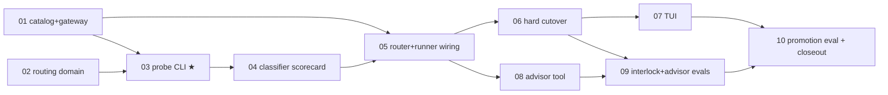

# Model Router + Advisor

Virtual model routing (`--model frontier|balanced|economy`) plus an optional `ask_advisor` tool,
interlocked: routing changes nudge the advisor; advisor consults trigger the router. Hard cutover:
`frontier` becomes the default model. First playable checkpoint: the `duet route` probe CLI, which
is also the permanent prompt-tweaking workbench.

Planning record: [`unknowns-map.md`](./unknowns-map.md) — the decision ledger there is **fixed**;
do not relitigate it. This README + `slices/` supersede the map's "tweakable plan" and kickoff
prompt sections.

## Next Agent Prompt

_Last updated: 2026-07-18 (slices 01+02 merged and green: 961 tests)._

You are implementing this feature slice by slice. Next pickup:
[`slices/03-route-probe-cli.md`](./slices/03-route-probe-cli.md) (deps 01+02 are done); the
transcript-library part of slice 08 is dependency-free and may run in parallel. Before wiring
anything, read `unknowns-map.md` §Quadrant 2 (fixed decisions) and §Quadrant 4 (landmines — they
are constraints). Update this section (status, pickup point, checklist) before ending your pass.
When a slice's implementation starts changing variables the slice doesn't own, stop and reslice
per write-spec instead of broadening the patch.

**Active warning:** `gateway.duet.so` currently errors on all three new models (kimi-k3, sol,
terra) — service-side allowlist gap, David's action item; see slice 01's post-merge addendum.
Live work must use `AI_GATEWAY_API_KEY`/`OPENROUTER_API_KEY` paths until fixed.

**Global TODO** (owning slice in parens):

- [x] Catalog entries + kimi effort/vision wire evidence (01) — merged `a802159`; kimi high→max
      mapping, wire evidence in slice file
- [x] Routing domain library: table, schema, loader, resolve, vision guard (02) — merged
      `e9a620e`; 24 new tests
- [ ] Classifier + `duet route` probe + `duet config export` ★ first playable (03)
- [ ] Classifier scorecard eval + tuning pass 1 (04)
- [ ] ModelRouter state machine + turn-runner wiring + `router_switch` + swap-safety fixes (05)
- [ ] Hard cutover: frontier default, virtual-aware `/model` surfaces, pin/suspend (06)
- [ ] TUI: two-layer display, switch rendering, `/route` inspector (07)
- [ ] Advisor: transcript lib, `ask_advisor` tool, AI SDK call, preview probe (08)
- [ ] Interlock (reroute nudge) + advisor prompt tuning + advisor evals (09)
- [ ] Mixed-task promotion eval + closeout tuning + stale-comment audit (10)

Blockers: none. Builder-confirm facts from the map are pre-resolved where drafts verified them
(noted in the owning slice); the rest resolve inside their slice.

## Slice graph

Parallel tracks: S1 ∥ S2/S3 · after S5: the S6→S7 track ∥ S8 · S9 joins them.

## Architecture: single-owner invariants

New package **`src/model-routing/`** is the sole owner of virtual-model semantics. It must read
as designed-today, not bolted on:

| Concept                                                                                                            | One owner                                                                                 |
| ------------------------------------------------------------------------------------------------------------------ | ----------------------------------------------------------------------------------------- |
| Table shape, TypeBox schema, built-in default table                                                                | `src/model-routing/table.ts`                                                              |
| Disk IO for `.duet/models.json` (load/validate/export)                                                             | `src/model-routing/loader.ts`                                                             |
| Virtual→concrete resolution, cycle detection, vision guard                                                         | `src/model-routing/resolve.ts` (pure; catalog capability via injected adapter)            |
| ALL tunable prompt text (classifier, advisor tool desc, advisor system prompt, reroute nudge, advice-weight block) | `src/model-routing/prompts.ts`                                                            |
| Classifier input assembly + structured-output call                                                                 | `src/model-routing/classifier.ts`                                                         |
| Routing runtime state: step counters, cadence, pin, advisor gate, nudge, interlock                                 | `src/model-routing/router.ts` (`ModelRouter`, injected classifier, zero pi-agent imports) |
| Advisor transcript assembly (pure)                                                                                 | `src/model-routing/advisor-transcript.ts`                                                 |
| Advisor LLM call (AI SDK `generateText` via existing duet gateway)                                                 | `src/model-routing/advisor.ts`                                                            |

Rules the review of every slice enforces:

- `src/model-resolution/` stays **concrete-only** — `resolveModelName` semantics untouched;
  `resolver.ts`/`catalog.ts` never import from `model-routing/`.
- The turn runner **adapts, never decides**: any route/cadence conditional found in
  `turn-runner.ts` is a slice violation. It translates events into `ModelRouter` calls and applies
  the returned decisions.
- Session persists the **selection** (virtual name), never a transient concrete route.
- The classifier gets a **lean input** (rules + guidance + current target + bounded prev-turn hint
  - step delta + image flag), never the full transcript.
- The `duet route` probe composes the **same code path** as production classification — the
  workbench can never lie.
- Prompt-tuning slices may edit only `prompts.ts`, route `description` strings, and numeric
  config. Eval fixtures/labels are oracles, not tuning knobs — relabeling needs a recorded
  product rationale.
- Hard cutover: no compat shims, no opt-out flag, no migrations, no dual defaults. No module
  re-exports an upstream API as a compatibility wrapper (if `createDuetModelGateway` moves out of
  `src/cli/`, move it and update consumers).
- One short-lived seam is permitted: S5 proves swaps with a scripted fake classifier through the
  real `ModelRouter` seam — it is a test fixture, not a runtime hook, and nothing ships for it.

## Verification floor (every slice)

`bun run check-types && bun run lint && bun run format:check && bun run test` stay green.
Live evals: `evals/*.eval.ts`, docker-gated (`testIfDocker`), `EVAL_MODEL` override, generous
timeouts; run individually while tuning, `bun run eval` at promotion. Acceptance runs for routing
also run with `EVAL_MODEL` unset so the real luna classifier + table are exercised. Every eval
added here ships with a falsification check (break the thing → eval fails), per write-eval.

## Contracts fixed by the map (recap, not relitigable)

Default table (incl. creative-writing routes, economy `implement-visual`→luna, economy
general→luna **low**), one-classifier-call-over-all-entries, cache-awareness in the classifier
prompt only, reroute every 5 steps (tunable) + advisor-call-triggers-classifier, advisor floor
1-per-5-steps cap-exempt on reroute nudge, transcript = pinned first user msg + live observations
middle + tail at uniform ~10k tokens (≤20k), `.duet/models.json` optional complete-replacement
override + `duet config export`, bare virtual names win with load-error collisions, two-layer
display + `router_switch` event + `/route` inspector + pin-via-`/model <concrete>`, exemptions
(memory actor, classifier, advisor, explicit concrete state models), D1 advisor via existing AI
SDK gateway wrapper, D2 usage keyed on concrete per-message model ids, D3 router effort wins
(`/thinking` = non-routed sessions only).

## Decisions made at synthesis (with the alternatives that lost)

- **Cutover timing = after runner wiring (S6), before TUI polish and advisor.** Risk-first draft's
  argument won: "classifier latency must be invisible" is only falsifiable by dogfood, so dogfood
  starts at the earliest _safe_ moment — after swap mechanics are proven (S5), with `/model
<concrete>` as the escape hatch. Rejected alternatives: cutover-before-runtime-routing (routes
  only at boot — half-broken dogfood) and cutover-last (delays the only real latency test).
- **Sub-agent models: explicit virtual only.** A per-state `model` naming a virtual re-enters
  routing with that sub-agent's context. An _omitted_ state model keeps today's inheritance of the
  parent's current model unchanged. Rejected: omitted-model-inherits-virtual-identity-and-
  classifies-independently (a behavior change to existing sessions this feature doesn't need).
- **Package name `src/model-routing/`** beside `src/model-resolution/` (drafts split between
  `routing/`, `model-routing/`, and in-place files; sibling naming makes the ownership pair
  legible).
- **Swap-safety proven via fake classifier through the real seam**, not a dedicated test-only
  runtime policy hook (one draft proposed `routerTestPolicy`; the injected-classifier seam gives
  the same determinism with no shipped test surface).
- **Advisor-quality eval is optional scope** inside S9 (one draft proposed it as a required
  second eval; trigger + incorporation assertions cover the map's definition of done, quality
  grading can be added if advice feels weak in dogfood).

## Known unknowns still open (owning slice)

Kimi effort delivery through the gateway (01) · classifier p50/p95 latency ceiling — freeze after
measuring, before final tuning (04) · prev-turn hint shape: assistant summary vs last-N tool
names — resolved by continuity corpus measurement (04) · `readSessionObservations` from the tool
storage closure (08).
